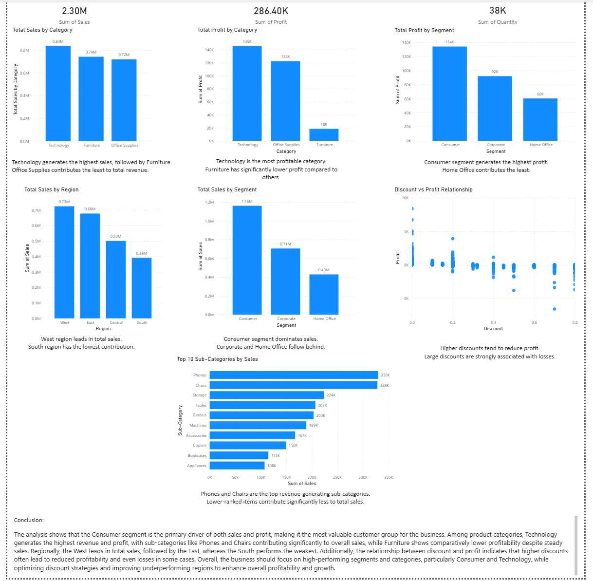

# Sales Analytics Project

## 📊 Overview

This project focuses on analyzing sales data using Python and visualizing key business insights through a Power BI dashboard. The goal is to identify trends in sales, profit, customer segments, and regional performance to support data-driven decision-making.

---

## 🛠️ Tools & Technologies

* Python (Pandas, Matplotlib, Seaborn)
* Jupyter Notebook
* Power BI

---

## 📁 Project Files

* **analysis.ipynb** → Python notebook containing full data analysis and visualizations
* **analysis.html** → Exported version of notebook with charts and outputs
* **sales_data.csv** → Dataset used for analysis
* **Sales & Revenue Dashboard.pbix** → Power BI dashboard file
* **dashboard.png** → Screenshot preview of dashboard

---

## 📌 Key Insights

* Technology category generates the highest sales and profit
* Consumer segment is the primary driver of revenue
* West region leads in total sales, while South performs the lowest
* Sub-categories like Phones and Chairs contribute significantly to overall sales
* Higher discounts are strongly associated with reduced profit and losses

---

## 📊 Dashboard Preview

---

## 📈 Conclusion

The analysis highlights that the Consumer segment and Technology category are the main contributors to business performance, making them critical focus areas for growth. While strong sales are observed in regions like the West, underperforming regions such as the South require strategic attention. Additionally, the relationship between discount and profit indicates that excessive discounting negatively impacts profitability. Overall, the business should prioritize high-performing segments and optimize pricing strategies to improve overall efficiency and maximize profit.

---

## 🚀 How to Use

1. Open **analysis.ipynb** in Jupyter Notebook to view code and analysis
2. Open **analysis.html** in a browser for a quick visual view
3. Open **.pbix file** in Power BI Desktop to explore the dashboard

---
